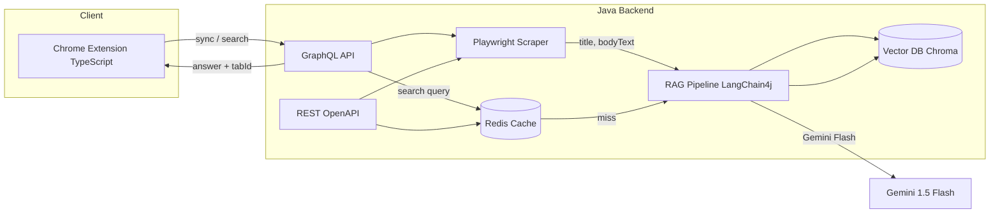

# Context-Switcher

**An AI-powered Chrome extension with a Java (Spring Boot) backend** — semantic search across your open browser tabs. Ask questions (e.g. “Which tab had the API pricing?”) and get answers with citations and “Jump to tab.”

---

## Architecture

The system has three main parts: **Client** (Chrome extension), **Brain** (Java backend), and **Memory** (vector DB + optional Redis cache).

### High-level flow



- **Extension (TypeScript):** Collects open tab URLs and tab IDs, sends sync/search over **GraphQL** (only the fields it needs, e.g. `answer` and `citations { tabId url snippet }`), shows results and “Jump to tab.”
- **Java backend:** **Gradle (wrapper)** for build. **GraphQL** is the primary API; **OpenAPI/Swagger** documents the REST surface. Playwright for Java scrapes URLs; Spring Boot + LangChain4j handle RAG; Redis caches search results.

### Data flow

1. **Sync:** User clicks “Sync Tabs” → extension sends URLs + tabIds → backend scrapes with Playwright → chunks text → embeds (LangChain4j) → stores in vector DB with metadata (url, tabId).
2. **Search:** User types a question → extension sends query via GraphQL → backend checks Redis; on miss → embeds query → vector search (top-k chunks) → Gemini Flash with context → answer + citations → cache and return. Extension shows answer and “Jump to tab” for each citation.

---

## Tech stack

| Layer                | Technology                                                                              |
| -------------------- | --------------------------------------------------------------------------------------- |
| Extension UI & logic | TypeScript, Tailwind, Manifest V3                                                       |
| Backend              | Java 21, Spring Boot 3.x, Gradle (wrapper, Groovy DSL)                                  |
| Scraping             | Playwright for Java (headless Chromium)                                                |
| API                  | GraphQL (Spring for GraphQL, primary); OpenAPI/Swagger (REST spec + Swagger UI)         |
| RAG & LLM            | LangChain4j, Gemini 1.5 Flash, embedding model                                         |
| Vector DB            | ChromaDB (local/Docker)                                                                |
| Cache                | Redis (local/Docker)                                                                   |

---

## Repo layout

```
ContextSwitcher/
├── extension/          # TypeScript Chrome extension (Vite + Tailwind)
│   ├── src/
│   │   ├── popup/
│   │   ├── background/
│   │   └── graphql/
│   └── manifest.json
├── backend/            # Spring Boot + Playwright + LangChain4j (Gradle)
│   ├── src/main/java/com/contextswitcher/
│   │   ├── scraper/    # TabInput, TabContent, PlaywrightScraperService
│   │   ├── rag/        # ChunkingService, EmbeddingService, VectorStore, RagService
│   │   └── graphql/    # resolvers + schema
│   ├── src/main/resources/
│   │   ├── application.yml
│   │   ├── graphql/schema.graphqls
│   │   └── openapi/openapi.yaml
│   ├── build.gradle
│   ├── gradlew
│   └── gradle/wrapper/
├── docker-compose.yml  # Redis, ChromaDB (optional)
└── README.md
```

---

## Implementation plan

### Phase 1: Java backend core (Playwright + RAG + vector DB)

- **Goal:** Spring Boot app that accepts tab URLs, scrapes with Playwright, chunks text, embeds and stores in a vector DB, and answers search queries via RAG (Gemini Flash).
- **Steps:** Gradle + DTOs → PlaywrightScraperService → ChunkingService → vector store (ChromaDB or in-memory) → RagService → GraphQL (syncTabs, search).
- **Done when:** You can sync tab URLs and run a search query and get an answer with citations (tabId, url, snippet).

### Phase 2: GraphQL API, OpenAPI/Swagger, Redis cache

- **Goal:** GraphQL as primary API; OpenAPI spec + Swagger UI for REST; Redis cache for search results.
- **Steps:** Spring for GraphQL schema and resolvers; OpenAPI 3 spec and SpringDoc; Redis with cache key e.g. `search:{sessionId}:{hash(query)}`, TTL 5–15 min.

### Phase 3: Chrome extension (TypeScript)

- **Goal:** Manifest V3 extension with “Sync Tabs” and search UI; calls backend GraphQL; “Jump to tab” from citations.
- **Steps:** TypeScript + Vite + Tailwind; `chrome.tabs.query` → syncTabs mutation; search query → display answer + citation buttons that focus the tab.

### Phase 4: Integration and polish

- Docker Compose for backend + Redis + ChromaDB; privacy notice (localhost, data to Gemini); token/chunk limits; learning checkpoints.

---

## Risks and mitigations

- **ChromaDB Java client:** Use Chroma HTTP API from Java or fallback to in-memory / Redis / pgvector.
- **Playwright:** Scraping many tabs can be slow — limit concurrent pages and timeouts; show “Syncing…” in the extension.
- **Redis cache:** On `syncTabs`, invalidate or scope cache by session so new sync doesn’t serve stale search results.

---

## Quick start (backend)

```bash
cd backend
export GEMINI_API_KEY=your-key   # no spaces around =
./gradlew bootRun
```

Backend runs at `http://localhost:8080`. GraphQL at `/graphql` (once Phase 1/2 are in place).
