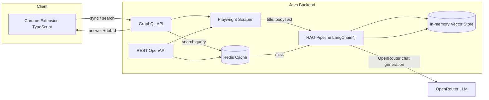

# Context-Switcher

**An AI-powered Chrome extension with a Java (Spring Boot) backend** — semantic search across your open browser tabs. Ask questions (e.g. “Which tab had the API pricing?”) and get answers with citations and “Jump to tab.”

---

## Architecture

The system has three main parts: **Client** (Chrome extension), **Brain** (Java backend), and **Memory** (in-memory vector index + optional Redis answer cache).

### High-level flow



- **Extension (TypeScript):** Collects open tab URLs and tab IDs, sends sync/search over **GraphQL** (only the fields it needs, e.g. `answer` and `citations { tabId url snippet }`), shows results and “Jump to tab.” Popup state (last question/answer/citations) is persisted across popup close/reopen.
- **Java backend:** **Gradle (wrapper)** for build. **GraphQL** is the primary API; **OpenAPI/Swagger** documents the REST surface. Playwright for Java scrapes URLs; Spring Boot + LangChain4j handle RAG; Redis caches search results.

### Data flow

1. **Sync:** User chooses sync scope (`all tabs in this window` or `active tab only`) and clicks Sync → extension sends URLs + tabIds → backend scrapes with Playwright → chunks text → embeds with Gemini `embedContent` (`gemini-embedding-001`) → stores chunks + vectors in the in-memory `VectorStore`.
2. **Search:** User types a question → extension sends query via GraphQL → backend embeds query → vector search (top-k chunks) → checks Redis answer cache; on miss → OpenRouter chat completion with retrieved context → answer + citations → cache and return. Extension shows answer and “Open tab”; if original tab ID is gone it falls back to URL match / open.

---

## Tech stack

| Layer                | Technology                                                                              |
| -------------------- | --------------------------------------------------------------------------------------- |
| Extension UI & logic | TypeScript, Tailwind, Manifest V3                                                       |
| Backend              | Java 21, Spring Boot 3.x, Gradle (wrapper, Groovy DSL)                                  |
| Scraping             | Playwright for Java (headless Chromium)                                                |
| API                  | GraphQL (Spring for GraphQL, primary); OpenAPI/Swagger (REST spec + Swagger UI)         |
| RAG & LLM            | OpenRouter (natural-language generation), Gemini embeddings (`gemini-embedding-001`)   |
| Vector DB            | In-memory vector store (`VectorStore`)                                                  |
| Cache                | Redis (local/Docker)                                                                   |

---

## Repo layout

```
ContextSwitcher/
├── extension/          # TypeScript Chrome extension (Vite + Tailwind)
│   ├── src/
│   │   ├── popup/
│   │   ├── background/
│   │   └── graphql/
│   └── manifest.json
├── backend/            # Spring Boot + Playwright + LangChain4j (Gradle)
│   ├── src/main/java/com/contextswitcher/
│   │   ├── scraper/    # TabInput, TabContent, PlaywrightScraperService
│   │   ├── rag/        # ChunkingService, EmbeddingService, VectorStore, RagService
│   │   └── graphql/    # resolvers + schema
│   ├── src/main/resources/
│   │   ├── application.yml
│   │   ├── graphql/schema.graphqls
│   │   └── openapi/openapi.yaml
│   ├── build.gradle
│   ├── gradlew
│   └── gradle/wrapper/
└── README.md
```

---

## Implementation plan

### Phase 1: Java backend core (Playwright + RAG + vector store)

- **Goal:** Spring Boot app that accepts tab URLs, scrapes with Playwright, chunks text, embeds and stores in a vector DB, and answers search queries via RAG (OpenRouter generation + Gemini embeddings).
- **Steps:** Gradle + DTOs → PlaywrightScraperService → ChunkingService → in-memory `VectorStore` → RagService → GraphQL (syncTabs, search).
- **Done when:** You can sync tab URLs and run a search query and get an answer with citations (tabId, url, snippet).

### Phase 2: GraphQL API, OpenAPI/Swagger, Redis cache

- **Goal:** GraphQL as primary API; OpenAPI spec + Swagger UI for REST; Redis cache for search results.
- **Steps:** Spring for GraphQL schema and resolvers; OpenAPI 3 spec and SpringDoc; Redis with cache key e.g. `search:{sessionId}:{hash(query)}`, TTL 5–15 min.

### Phase 3: Chrome extension (TypeScript)

- **Goal:** Manifest V3 extension with “Sync Tabs” and search UI; calls backend GraphQL; “Jump to tab” from citations.
- **Steps:** TypeScript + Vite + Tailwind; `chrome.tabs.query` → syncTabs mutation; search query → display answer + citation buttons that focus the tab.

### Phase 4: Integration and polish

- Docker Compose for backend + Redis + ChromaDB; privacy notice (localhost, data sent to configured model providers); token/chunk limits; learning checkpoints.

---

## Risks and mitigations

- **Embedding rate limits (Gemini 429):** Backoff + retries are in place; if limits persist, sync fewer tabs, increase delay, or check quota/billing.
- **Playwright:** Scraping many tabs can be slow — limit concurrent pages and timeouts; show “Syncing…” in the extension.
- **Redis cache:** On `syncTabs`, invalidate or scope cache by session so new sync doesn’t serve stale search results.

---

## Quick start (backend)

```bash
cd backend
export GEMINI_API_KEY=your-gemini-key          # for embeddings
export OPENROUTER_API_KEY=your-openrouter-key  # for natural-language generation
export CACHE_REDIS_ENABLED=true                # optional: Redis answer cache
./gradlew bootRun
```

Backend runs at `http://localhost:8080`. GraphQL at `/graphql` (once Phase 1/2 are in place).

### Optional: run Redis locally (for cache)

```bash
brew install redis
brew services start redis
```

By default the app expects Redis at `localhost:6379`.

---

## Extension behavior notes

- **Popup lifecycle:** Chrome popup closes when it loses focus. The extension persists the last question, answer, citations, and status so reopening continues where you left off.
- **Sync scope:** Choose between syncing all HTTP(S) tabs in the current window or only the active tab.
- **Open tab action:** Citation button activates by tab ID; if that tab no longer exists, it tries matching by URL, then opens a new tab with the citation URL.

---

## Embedding reliability tuning

The backend includes retries/backoff for Gemini embedding calls plus optional pacing between chunk embeds.

`application.yml` knobs:

- `app.rag.embed-chunk-delay-ms` (default `120`)
- `app.rag.gemini-embed-max-attempts` (default `8`)
- `app.rag.gemini-embed-initial-backoff-ms` (default `900`)
